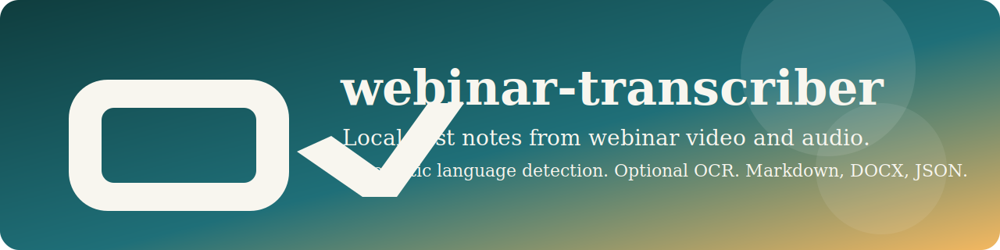

# webinar-transcriber



[](https://github.com/megabyde/webinar-transcriber/actions/workflows/ci.yml)


`webinar-transcriber` is a local-first CLI for transcribing webinar videos with slides and
audio-only recordings. The tool exports Markdown, DOCX, and JSON, supports automatic language
detection, and can optionally improve slide alignment with OCR.

## Status

The project is under active development. The repository currently contains the bootstrap
tooling, CLI shell, docs, and CI wiring for the first implementation milestone.

## Planned CLI

```bash
webinar-transcriber process INPUT
webinar-transcriber process INPUT --ocr
webinar-transcriber process INPUT --output-dir runs/custom-demo
```

## Local Setup

1. Install Python 3.12 and `uv`.
2. Install native dependencies with Homebrew on macOS:
   - `brew install ffmpeg`
   - `brew install tesseract`
3. Install the project:

```bash
make sync
```

## Quality Gates

Every logical implementation step is expected to pass the full verification cycle before it is
committed:

```bash
make format
make lint
make typecheck
make test
make coverage
```

## Documentation

- [Architecture](docs/architecture.md)
- [Usage](docs/usage.md)
- [Languages](docs/languages.md)
- [Development](docs/development.md)
